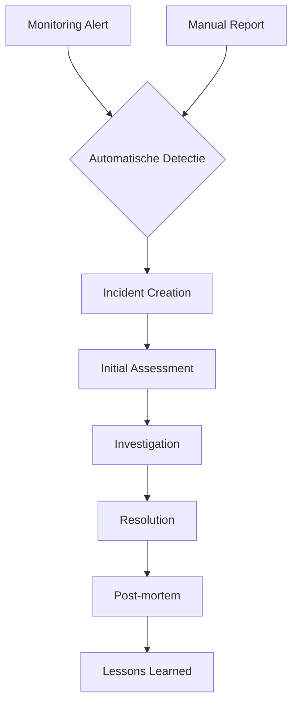

# Incident Management

## Overzicht

Het incident management systeem van PulseGuard helpt u bij het detecteren, onderzoeken en oplossen van problemen met uw digitale infrastructuur. Het systeem combineert automatische detectie met handmatige incident creatie en uitgebreide collaboration tools.

## Incident Lifecycle

### 1. Detectie


### 2. Classificatie
Incidents worden automatisch geclassificeerd op severity:

- Critical: Complete service uitval, security breach
- **🟠 High**: Gedeeltelijke uitval, significante impact
- **🟡 Medium**: Gedegradeerde performance, minor issues
- Low: Cosmetische problemen, informational

### 3. Escalatie
```json
{
  "escalation_policy": {
    "critical": {
      "immediate_notification": true,
      "escalate_after_minutes": 5,
      "on_call_rotation": true
    },
    "high": {
      "immediate_notification": true,
      "escalate_after_minutes": 15
    },
    "medium": {
      "digest_mode": true,
      "escalate_after_minutes": 60
    }
  }
}
```

## Incident Creatie

### Automatische Incident Creatie

#### Threshold-based Incidents
```json
{
  "triggers": {
    "domain_down": {
      "condition": "response_time > 30000 OR status_code >= 500",
      "duration_minutes": 2,
      "auto_create_incident": true,
      "severity": "critical"
    },
    "high_error_rate": {
      "condition": "error_rate > 10%",
      "duration_minutes": 5,
      "auto_create_incident": true,
      "severity": "high"
    }
  }
}
```

#### AI-gedreven Incident Creatie
```json
{
  "ai_detection": {
    "anomaly_detection": {
      "enabled": true,
      "sensitivity": "medium",
      "false_positive_filter": true
    },
    "pattern_recognition": {
      "enabled": true,
      "historical_analysis_days": 30
    }
  }
}
```

### Manual Incident Creatie
```json
{
  "manual_incident": {
    "title": "Database Connection Issues",
    "description": "Users reporting slow page loads",
    "severity": "high",
    "affected_services": ["web-app", "api-server"],
    "tags": ["database", "performance"],
    "assignee": "devops-team"
  }
}
```

## Incident Onderzoek

### Evidence Collection

#### Screenshots & Logs
```json
{
  "evidence": {
    "screenshots": [
      {
        "url": "https://pulsefiles.com/screenshots/incident-123-404-error.png",
        "timestamp": "2024-01-17T10:30:00Z",
        "description": "404 error page screenshot"
      }
    ],
    "logs": {
      "application_logs": "/var/log/app/error.log",
      "system_logs": "/var/log/syslog",
      "time_range": "2024-01-17T10:00:00Z - 2024-01-17T11:00:00Z"
    }
  }
}
```

#### Metrics Correlation
```json
{
  "correlation_analysis": {
    "time_window": "1h",
    "metrics": {
      "cpu_usage": "spike at 10:25",
      "memory_usage": "steady increase",
      "error_rate": "sudden jump",
      "response_time": "gradual increase"
    },
    "related_incidents": ["incident-45", "incident-67"]
  }
}
```

### Collaboration Tools

#### Comments & Updates
```json
{
  "communication": {
    "comments": [
      {
        "author": "alice@company.com",
        "timestamp": "2024-01-17T10:35:00Z",
        "content": "Investigating database connection pool exhaustion",
        "internal_only": false
      }
    ],
    "status_updates": [
      {
        "status": "investigating",
        "message": "Team is investigating root cause",
        "timestamp": "2024-01-17T10:30:00Z"
      }
    ]
  }
}
```

#### Stakeholder Notifications
```json
{
  "notifications": {
    "internal": {
      "slack_channels": ["#incidents", "#devops"],
      "email_groups": ["devops@company.com", "management@company.com"]
    },
    "external": {
      "status_page": true,
      "customer_emails": ["vip-customers@company.com"],
      "social_media": false
    }
  }
}
```

## Status Page Integratie

### Automatische Updates
```json
{
  "status_page_integration": {
    "auto_update": true,
    "incident_states": {
      "investigating": "Investigating",
      "identified": "Identified",
      "monitoring": "Monitoring",
      "resolved": "Resolved"
    },
    "maintenance_mode": {
      "scheduled_maintenance": true,
      "emergency_maintenance": true
    }
  }
}
```

### Public Communications
```json
{
  "public_updates": [
    {
      "timestamp": "2024-01-17T10:30:00Z",
      "message": "We are experiencing issues with our API. Our team is investigating.",
      "status": "investigating"
    },
    {
      "timestamp": "2024-01-17T11:15:00Z",
      "message": "Root cause identified: Database connection pool exhausted. Rolling back deployment.",
      "status": "identified"
    }
  ]
}
```

## Resolution Process

### Incident Resolution
```json
{
  "resolution": {
    "root_cause": "Database migration caused connection pool exhaustion",
    "solution": "Rolled back to previous version and increased connection pool size",
    "resolved_at": "2024-01-17T12:00:00Z",
    "resolved_by": "bob@company.com",
    "verification_steps": [
      "Monitor connection pool usage for 1 hour",
      "Verify all services responding normally",
      "Confirm with affected users"
    ]
  }
}
```

### Follow-up Actions
```json
{
  "follow_up": {
    "preventive_measures": [
      "Increase database connection pool size",
      "Add connection pool monitoring",
      "Implement gradual deployment strategy"
    ],
    "monitoring_improvements": [
      "Add database performance metrics",
      "Implement connection pool alerts",
      "Create database health dashboard"
    ],
    "documentation_updates": [
      "Update deployment procedures",
      "Document troubleshooting steps",
      "Create incident response playbook"
    ]
  }
}
```

## Post-mortem Analysis

### Incident Review
```json
{
  "post_mortem": {
    "timeline": [
      {
        "time": "10:00",
        "event": "Deployment started",
        "details": "New version pushed to production"
      },
      {
        "time": "10:15",
        "event": "First alerts",
        "details": "Slow response times detected"
      },
      {
        "time": "10:30",
        "event": "Incident declared",
        "details": "Multiple services affected"
      }
    ],
    "impact_assessment": {
      "affected_users": 12500,
      "downtime_minutes": 75,
      "financial_impact": "$15,000",
      "reputational_impact": "medium"
    },
    "lessons_learned": [
      "Test database migrations in staging first",
      "Monitor connection pool metrics",
      "Have rollback plan ready"
    ]
  }
}
```

### Continuous Improvement
```json
{
  "improvements": {
    "process_changes": [
      "Implement mandatory staging deployment tests",
      "Add database migration validation",
      "Create incident response simulation exercises"
    ],
    "technical_changes": [
      "Implement database connection pool monitoring",
      "Add circuit breakers for database calls",
      "Create automated rollback scripts"
    ],
    "team_changes": [
      "Cross-train team members on database operations",
      "Establish on-call rotation schedule",
      "Create incident response documentation"
    ]
  }
}
```

## Analytics & Reporting

### Incident Metrics
```json
{
  "analytics": {
    "monthly_stats": {
      "total_incidents": 23,
      "average_resolution_time": "2.5 hours",
      "mttr_by_severity": {
        "critical": "45 minutes",
        "high": "2 hours",
        "medium": "4 hours"
      },
      "false_positives": 3
    },
    "trends": {
      "incident_frequency": "decreasing",
      "resolution_time": "improving",
      "common_root_causes": [
        "Database issues (35%)",
        "Deployment problems (25%)",
        "Network issues (15%)"
      ]
    }
  }
}
```

### Performance Indicators
```json
{
  "kpis": {
    "mean_time_to_detect": "5 minutes",
    "mean_time_to_resolve": "2 hours",
    "incident_prevention_rate": "85%",
    "customer_satisfaction": 4.2,
    "team_satisfaction": 4.5
  }
}
```

## Integration Capabilities

### External Tool Integratie
```json
{
  "integrations": {
    "jira": {
      "auto_create_tickets": true,
      "link_incidents": true,
      "sync_status": true
    },
    "pagerduty": {
      "escalation_policies": true,
      "on_call_schedule": true,
      "incident_sync": true
    },
    "slack": {
      "incident_channels": ["#incidents"],
      "status_updates": true,
      "command_integration": true
    }
  }
}
```

### API Access
```bash
# Incident lijst
GET /api/incidents

# Incident details
GET /api/incidents/{id}

# Incident aanmaken
POST /api/incidents

# Incident bijwerken
PUT /api/incidents/{id}

# Comments toevoegen
POST /api/incidents/{id}/comments

# Status updates
POST /api/incidents/{id}/updates
```

## Best Practices

### Incident Response
1. **Acknowledge Quickly**: Bevestig incident binnen 5 minuten
2. **Assess Impact**: Bepaal omvang en ernst snel
3. **Communicate Clearly**: Houd stakeholders op de hoogte
4. **Document Everything**: Log alle acties en beslissingen

### Prevention
1. **Monitor Proactively**: Gebruik predictive analytics
2. **Test Regularly**: Voer chaos engineering uit
3. **Automate Where Possible**: Gebruik Infrastructure as Code
4. **Learn from Incidents**: Analyseer en verbeter continu

### Team Coordination
1. **Define Roles**: Duidelijke verantwoordelijkheden
2. **Establish Communication**: Standaard communicatiemethodes
3. **Create Playbooks**: Documented response procedures
4. **Train Regularly**: Incident response training

### Continuous Improvement
1. **Review Incidents**: Wekelijkse incident reviews
2. **Update Procedures**: Leer van elke incident
3. **Measure Performance**: Track verbetering over tijd
4. **Share Knowledge**: Documenteer lessons learned